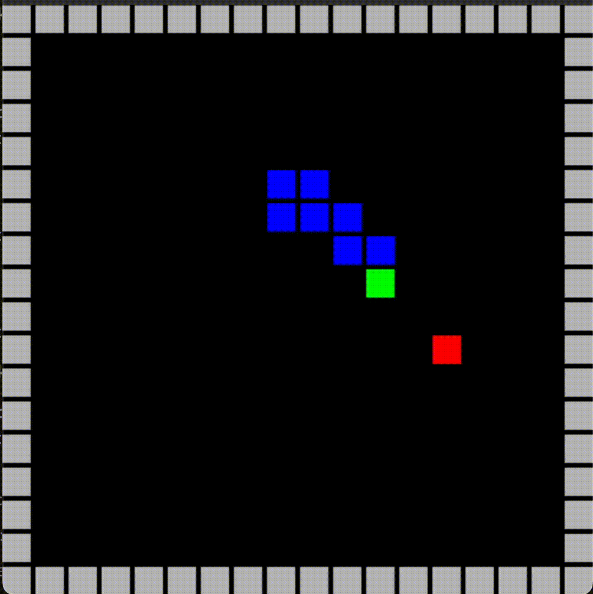

# Snake AI using Reinforcement Learning

The main objective of this project is to train an Agent to achieve the best possible score in the Snake game : 
- without knowing any strategy, but only being rewarded when eating apple, and punished when colliding the walls or itself
- discovering its environment at the First Person (there is no map provided)

The Agent is trained using the Deep Q-network, a Q-Learning variant based on a neural network.
The aim of DQN is to estimate the Q function with NN, when the state is becoming too huge for basic Q-Learning.




## description

the input of the NN consists in the encoded game environment, from the Snake point of view : 
- the wall distance in Front Left and Right directions
- the body distance in Front Left, Right and 4 diagonals directions
- the apple location (angle)

the ouput consists in one of the 3 possible actions : FORWARD, LEFT, RIGHT

the hidden layer of NN is currently 256

## training
current best results are achieved with : 
- a game board of 12x12
- gamma (discount rate) of 0.9
- replay batch of 1000
- learning rate 0.001
- and epsilon decay of 0.001 (for exploration/exploitation probability)

## results
- the Agent trained on 12x12 can also play on lower or hgher dimensions because of the normalized inputs
- currently has a mean score of 35 (best is 47 so far). 

## usage
### install
```
pip install -r requirements.txt
```

### run the Snake agent with the current model 
```
python3 UI.py
```

### train a new agent
```
python3 train.py
```
model is automatically saved in ./model/model.tch